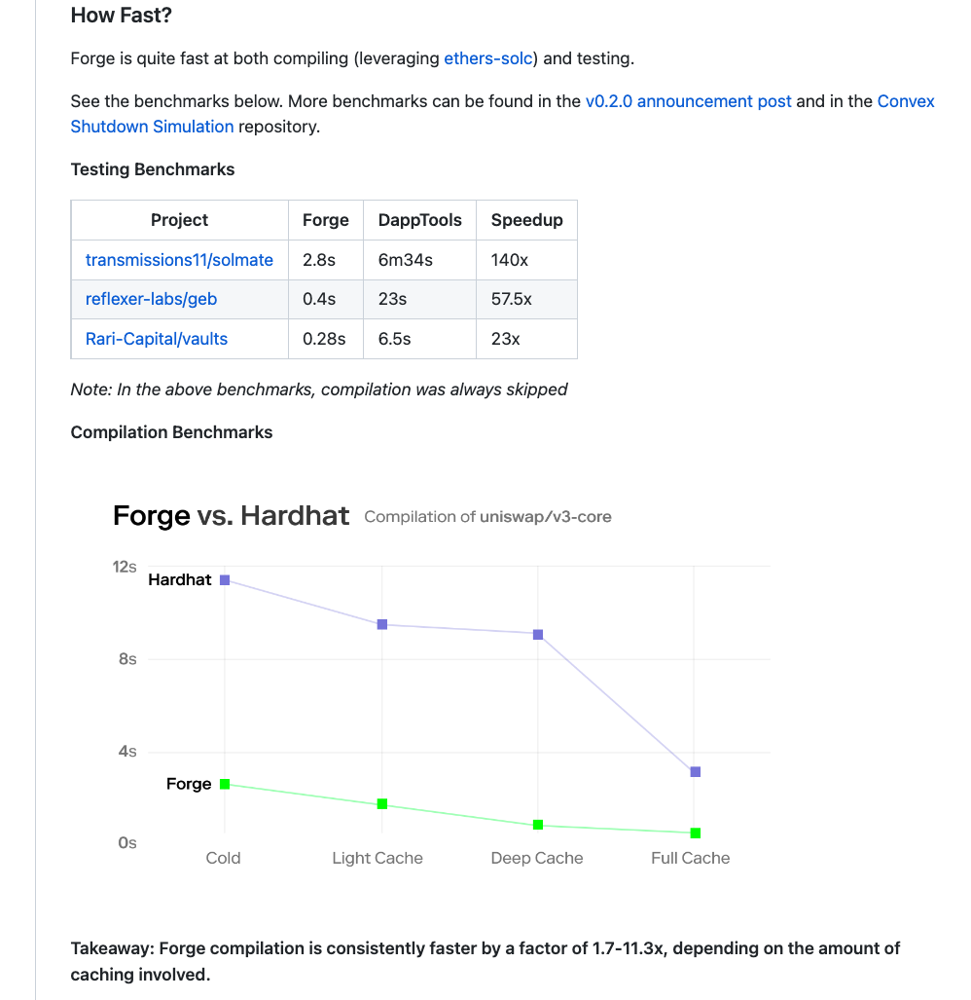

# Foundry Workshop

- Why Foundry? - 10 mins
- Workshop - 20 - 30 mins

## Why Foundry?

- Solidity Testing & Scripting

  - No context switching
  - Focus on 1 language
  - Write deployment scripts in Solidity

- Speed

  - Compilation is much faster
    

- Protocols are adopting

  - [SeaPort](https://github.com/ProjectOpenSea/seaport)
  - [UniSwap permit2](https://github.com/Uniswap/permit2)

- Features

  - Fuzzings Tests
  - Interactive Debugger
  - Call traces
  - Gas Reports
  - Solidity Scripting
  - Broadcast Transaction using CLI
  - EVM analysis tools (cast)

- Very well documented: [Foundry book](https://book.getfoundry.sh/)

## Workshop

### Installation and setup

For Mac & Linux:

- https://getfoundry.sh/
- now run:

```
foundryup
```

Now, in order to create a new project type:

```
forge init $PROJECT_NAME$
```

### Folder setup

```
├── foundry.toml
├── lib
│   ├── forge-std
│   └── INSTALLED-LIB
├── script
│   └── Counter.s.sol
├── src
│   └── Counter.sol
└── test
    └── Counter.t.sol
```

- Installed libraries are stored in `lib` folder
- In `src` we are writing our smart contracts
- In `test` we are writing our tests
- In `script` we are writing our deployment scripts

### Foundry tools

Foundry is made of 3 CLI tools - [Forge](https://book.getfoundry.sh/forge/), [Cast](https://book.getfoundry.sh/cast/) and [anvil](https://book.getfoundry.sh/anvil/)

<b>forge</b> - The Foundry CLI tool for compiling, testing and deploying smart contracts.

<b>cast</b> - The Foundry CLI tool for analyzing smart contracts and send transactions.

<b>anvil</b> - A local Ethereum node for testing and development (similart to Ganache / Hardhat Node).

### Installing libraries

Foundry uses git moudles for its libraries mangements, so we won't use npm like as we do in hh/truffle, instead we'll use `forge install $GITHUB_LINK` command to install libraries, ie:

```
forge install OpenZeppelin/openzeppelin-contracts
```

### remappings

- we need to define remappings in `foundry.toml` file in order to use libraries in our contracts.
- Each remapping is defined as a key-value pair in the `remappings` section of the `foundry.toml` file, ie:

```
remappings = [
  '@openzeppelin=lib/opezeeppelin-contracts'
]
```

## Writing a contract

We'll use a contract that:

- has a function that gets 0.01 ETH and stored the total deposit amount per address in a mapping
- has a function that returns total ETH recieved by each address
- has an access control that only allows the owner to withdraw the funds and only 5 blocks after the deployment block

Swtich the default `Counter.sol` with `Bank.sol`:

```solidity
// SPDX-License-Identifier: MIT
pragma solidity ^0.8.17;

import "@openzeppelin/contracts/access/Ownable.sol";


contract Bank is Ownable {
    uint256 public immutable withdrawalBlock;
    mapping(address => uint256) addressToDepositedValue;

    constructor() {
        withdrawalBlock = block.number + 5;
    }

    function deposit() public payable {
        require(msg.value > 0, "Must despoit more than 0");
        addressToDepositedValue[msg.sender] += msg.value;
    }

    function getDepositByAddress(address _address) public view returns (uint256) {
        return addressToDepositedValue[_address];
    }

    function withdraw() public onlyOwner {
        require(block.number >= withdrawalBlock, "Too early to withdraw");
        (bool success,) = msg.sender.call{value: address(this).balance}("");
        require(success, "Transfer failed.");
    }
}

```

## Testing a contract

Tests are written in Solidity and are stored in the `test` folder.
we'll use the following test template for our tests:

```solidity
// SPDX-License-Identifier: MIT
pragma solidity ^0.8.17;

import "forge-std/Test.sol";
import "src/Bank.sol";

contract BankTest is Test {
    Bank bank;

    function setUp() public {
        bank = new Bank();
    }

    function testWithdrawalBlock() public {
        assertEq(bank.withdrawalBlock(), block.number + 5);
    }

    function testDeposit() public {
    }

    function testWithdraw() public {
    }

    function testWithdrawFail() public {
    }

    function testWithdrawOnlyOwner() public {
    }

    function testFuzzDeposit(uint16 _value) public {
    }

}
```

- Every test contract has a function called `setUp` will will be called before every test function is executed
- Each test is a function that starts with `test` and must be either `public` or `external`
- We can use `assertEq` to check values values
- We can use some cheatcodes like `vm.prank()` `vm.roll()`, and `vm.expectRevert()` for our tests
- Logging: there are several ways we can log in our tests:
  - `forge test -vvv`
  - `console.log()`
  - emit foundry testing events, ie: `emit log_uint()`

### Fuzzing

- We can simply fuzz by adding an input to a test function
- The fuzzer will randomly generate inputs and run the test function with those inputs
- You can use `vm.assume()` to block some inputs

## Deploying a contract

well deploy our contract to a local environment using anvil

- `anvil` - default port is 8545
- contract can be deployed either by:
  - `forge create`
  - running a deployment script

### Forking

- We can run our contract on a forked network by using anvil
  `anvil --fork --rpc-url $FORKING_RPC_URL`

### Resources

- [Foundry book](https://book.getfoundry.sh/)
- [My Cheatsheet](https://github.com/ZenGo-X/foundry-cheatsheet)
